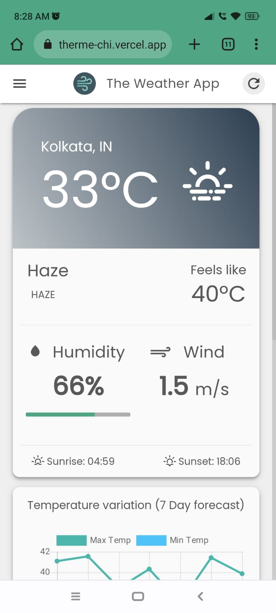

# The Weather App (WeatherME)
 
A simple material design weather website application with all the features present in a weather App.

## To get started - 

Run the index.html file after downloading the project or simply u can visit <a target="_blank" href="https://weatherme-chi.vercel.app/">weatherme.com</a> so tht your time doesnt get spent much 🙃

## Features

- Light/dark mode toggle
- 7 day weather forecast
- Humidity and wind speed
- Unit switching
- Updation tracker
- Location Error Prompter
- And many more

## For a contest -

## Resources used - 

Tried many a lot things :

a. Codepen.io

b. Openweather API

### Worked on -

- VS Code

- Windows 11

- Html, CSS, Javascript Framework

- Deployed from VERCEL

## Showcase

|                Dark Theme              |                Light Theme              |
|:-:|:-:|
|   |    |
|   |    |
|   |    |
|   |    |
|   |    |

  
## Contributions
This project would not have been possible without the efforts of the following people:
- Arunava Dutta &nbsp;[(@ArunavaCoderEm)](https://github.com/ArunavaCoderEm)
- Satyaki Dey &nbsp;[(@SatyakiDey75)](https://github.com/SatyakiDey75)
- Sonika Biswas &nbsp;[(@Sonika12Biswas)](https://github.com/Sonika12Biswas)
- Subhadeep Roy &nbsp;[(@subhadeep3902)](https://github.com/subhadeep3902)

## License
[Apache License 2.0 © Weather Me](https://github.com/subhadeep3902/Hack-Ur-Way-WeatherMe/blob/main/LICENSE)

## 🙋‍♂️ Support

💙 If you like this project, do give it a ⭐ and share it with your friends!  

---

Made with ❤️ and HTML, CSS and JS.   

